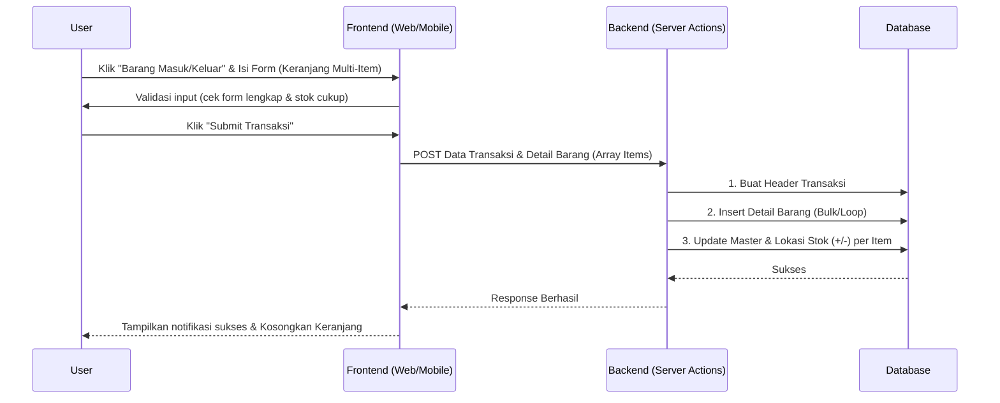
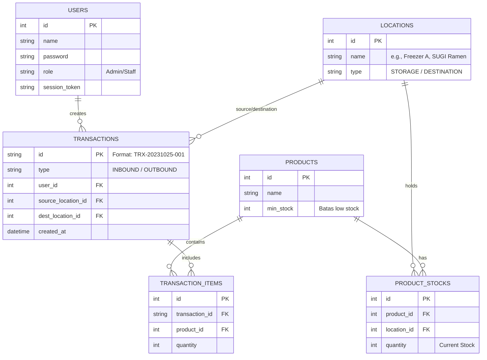

# PRD — Project Requirements Document

## 1. Overview
Saat ini, pencatatan keluar-masuk barang (inventory) di gudang cafe masih dilakukan secara manual dan disalin (copy-paste) ke WhatsApp. Proses manual ini sering menyebabkan *human error* (selisih stok), lupa mencatat barang masuk, dan memakan waktu.

Aplikasi **Sistem Inventaris Gudang Cafe** ini dirancang untuk mengatasi masalah tersebut. Tujuannya adalah menyediakan platform pencatatan yang rapi, cepat untuk mengecek sisa stok, dan memudahkan pelacakan riwayat barang masuk/keluar. Dengan fitur berbagi (*share*) langsung ke WhatsApp, aplikasi ini akan menjembatani kebiasaan komunikasi tim yang sudah ada dengan sistem rekapitulasi data yang jauh lebih akurat dan terpusat.

## 2. Requirements
1. **Berbasis Web / Responsif:** Harus dapat diakses dengan nyaman menggunakan HP (untuk operasional di gudang/dapur) maupun PC/Laptop (untuk admin).
2. **Real-time Session:** Perubahan data (stok berkurang/bertambah) harus dapat direfresh dengan cepat tanpa mengganggu sesi login pengguna (menggunakan session management yang baik).
3. **Fleksibilitas Lokasi & Tujuan:** Sistem harus mengakomodasi lokasi penyimpanan spesifik (Gudang Utama, Freezer A, Freezer B, Freezer C) dan tujuan pengeluaran (Dapur Produksi, SUGI Ramen, Garam Resto).
4. **Ekspor & Impor Data:** Mendukung pengisian *Master Data* secara massal menggunakan file Excel dan bagikan data (*Share to WA*) ke dalam format teks yang rapi.
5. **Multi-Item Transaksi:** Modul barang masuk dan keluar harus mendukung penginputan beberapa jenis barang dengan kuantitas berbeda dalam satu rangkaian input sebelum disimpan, agar operasional lebih cepat dan mengurangi fragmentasi log.

## 3. Core Features
- **Manajemen Akun (Login):** Tersedia dua akses, yakni **Admin** (kendali penuh termasuk master data) dan **Staff** (fokus pada input barang keluar/masuk).
- **Dashboard Interaktif:** Menampilkan rangkuman total barang, total item yang masuk kategori *low stock* (stok menipis), dan daftar detail barang apa saja yang perlu segera *restock*.
- **Modul Barang Masuk (Inbound):** Alur pendaftaran barang *restock* berbasis sistem keranjang/list. Pengguna memilih lokasi penyimpanan -> mencari/menambahkan barang ke daftar sementara -> mengisi jumlah per barang -> dapat menambahkan item lain secara bertahap dalam sesi yang sama -> menekan tombol **Submit** untuk menyimpan seluruh rangkaian barang tersebut dalam satu ID Transaksi yang sama ke database.
- **Modul Barang Keluar (Outbound):** Alur pengeluaran barang berbasis sistem keranjang/list. Pengguna menentukan lokasi asal dan tujuan -> menambahkan barang ke daftar pengeluaran -> mengisi jumlah per item -> menambah barang lain jika diperlukan -> menekan **Submit** untuk mencatat seluruh pengeluaran dalam satu ID Transaksi.
- **Riwayat Transaksi (History):** Menampilkan daftar transaksi. Setiap transaksi (yang dapat berisi gabungan beberapa barang dalam 1 sesi input) dibungkus dalam 1 "Card" visual berdasarkan ID Transaksi. Dilengkapi tombol **Share ke WA** (men-generate teks riwayat transaksi untuk dikirim ke grup tim).kemudian kita juga ada bagian tab untuk history per-barang misal nya dalam 30 hari terakhir (masuk dan keluar nya - dikeluarkan oleh siapa dan kemana)
- **Master Data:** Halaman pusat untuk melihat seluruh stok (dan filter *low stock*). Tersedia fitur tambah barang per item atau **Mass Input menggunakan Excel**. Data stok total juga bisa di-**Share ke WA**.

## 4. User Flow
1. **Login:** Staff/Admin membuka aplikasi dan login.
2. **Cek Kondisi (Dashboard):** Pengguna langsung disuguhkan *alert* jika ada barang yang *low-stock* pagi itu.
3. **Input Barang Datang:** Saat supplier datang, pengguna masuk ke menu **Barang Masuk** -> Pilih "Gudang Utama" -> Scan/Cari barang pertama (misal: Telur) -> Masukkan kuantitas (30) -> Klik "Tambah ke Daftar" -> Ulangi proses untuk barang berikutnya (misal: Minyak 2, Tepung 3) -> Setelah semua barang terisi dalam keranjang, klik **Submit** untuk menyimpan seluruh catatan dalam satu ID Transaksi.
4. **Distribusi Barang (Barang Keluar):** Saat cabang meminta bahan baku, pengguna masuk ke menu **Barang Keluar** -> Pilih "Freezer A" dan Tujuan "Garam Resto" -> Tambahkan barang ke daftar pengeluaran -> Isi jumlah -> Tambah barang lain secara bertahap -> Klik **Submit** untuk menyelesaikan transaksi multi-item tersebut.
5. **Pelaporan:** Pengguna masuk ke menu **Riwayat**, mencari transaksi pengeluaran barusan, dan menekan tombol *Share ke WA* untuk laporan di grup WhatsApp cafe.

## 5. Architecture
Aplikasi ini akan menggunakan arsitektur *Monolith berbasis Serverless* modern (Full-stack web framework). Frontend dan Backend disatukan dalam satu *codebase*, yang akan langsung berinteraksi dengan database.

## 6. Database Schema
Struktur database dirancang untuk melacak stok tidak hanya secara keseluruhan, tetapi juga berdasarkan lokasi spesifik penyimpanannya, dan mendukung relasi 1 header transaksi ke banyak detail barang.

**Daftar Tabel Terkait:**
- `users`: Menyimpan data akses login (Admin/Staff).
- `locations`: Menyimpan daftar lokasi (Tipe: Penyimpanan/Gudang atau Tujuan).
- `products`: Master data barang (Nama, Minimal Stok).
- `product_stocks`: Tabel pivot untuk merekam jumlah pasti sebuah produk di lokasi tertentu (misal: Berapa daging di Freezer A).
- `transactions`: Menyimpan ID transaksi utama, tipe (Masuk/Keluar), tanggal, asal pengirim, tujuan, dan siapa yang mencatat.
- `transaction_items`: Menyimpan rincian barang dan jumlahnya di dalam sebuah transaksi. Mendukung pencatatan multi-barang dalam 1 transaksi ID.

## 7. Tech Stack
Aplikasi akan dibangun dengan teknologi web modern yang cepat, aman, dan efisien secara biaya pengembangan:

- **Frontend & Backend (Full-stack):** Next.js (App Router) — Cepat, SEO friendly (jika diperlukan kedepannya), dan mudah mengatur integrasi API.
- **Styling / UI:** Tailwind CSS dan shadcn/ui — Untuk tampilan yang bersih, rapi, responsif, dan terlihat profesional layaknya aplikasi *enterprise*.
- **Database:** SQLite (melalui Turso/lokal) — Sangat ringan dan lebih dari cukup untuk ukuran data operasional beberapa cafe/restoran.
- **ORM:** Drizzle ORM — Untuk menghubungkan aplikasi dengan database secara aman (tipe data yang kuat).
- **Authentication:** Better Auth — Solusi modern dan aman untuk mengatur Login, sesi (session), keamanan akun, serta pembagian peran (Admin vs Staff).
- **Library Tambahan:** *XLSX* atau *SheetJS* untuk memproses impor data massal dari file Excel (Master Data).